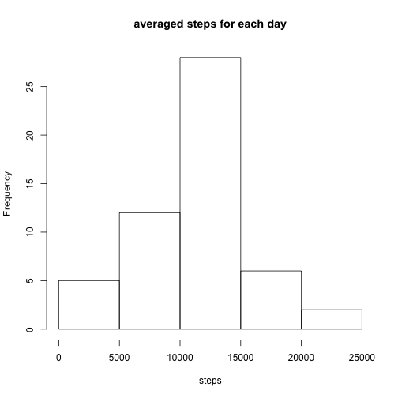
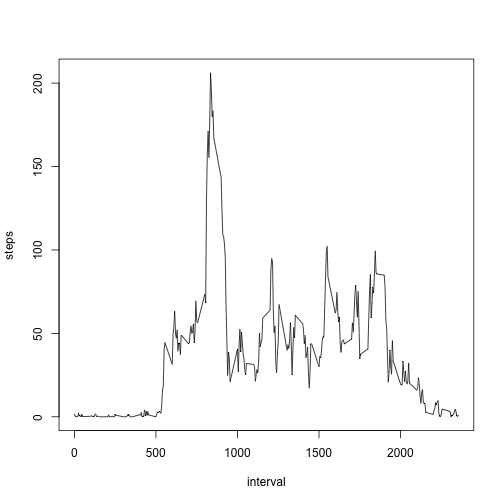
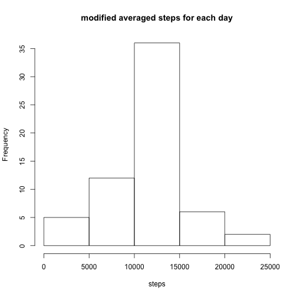
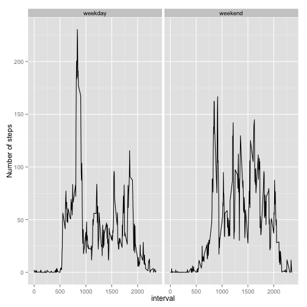

## Loading and preprocessing the data

```r
#Put the files in working directory.
data1 <- read.csv("activity.csv")
```


## What is mean total number of steps taken per day?
1.Calculate the total number of steps taken per day.
2.If you do not understand the difference between a histogram and a barplot, research the difference between them. Make a histogram of the total number of steps taken each day.
3.Calculate and report the mean and median of the total number of steps taken per day


```r
sum_by_day <- aggregate(data1$steps,by=list(data1$date),FUN=sum)
hist(sum_by_day$x,xlab = "steps",main = "averaged steps for each day")
```



```r
mean(sum_by_day$x,na.rm=TRUE) # mean value is10766.19
```

```
## [1] 10766.19
```

```r
median(sum_by_day$x,na.rm=TRUE) # median value is 10765
```

```
## [1] 10765
```


## What is the average daily activity pattern?
1.Make a time series plot (i.e. 𝚝𝚢𝚙𝚎 = "𝚕") of the 5-minute interval (x-axis) and the average number of steps taken, averaged across all days (y-axis)
2.Which 5-minute interval, on average across all the days in the dataset, contains the maximum number of steps?


```r
interval_average <- aggregate(data1$steps,by=list(data1$interval),FUN=mean,na.rm=TRUE)
plot(interval_average$Group.1,interval_average$x,type = 'l',xlab="interval",ylab = "steps")
```



```r
maxstep <- max(interval_average$x)
interval_average$Group.1[match(maxstep,interval_average$x)]
```

```
## [1] 835
```

```r
#The max step is 206.17, and the corresponding interval is 835
```


## Imputing missing values
1.Calculate and report the total number of missing values in the dataset (i.e. the total number of rows with 𝙽𝙰s)
2.Devise a strategy for filling in all of the missing values in the dataset. The strategy does not need to be sophisticated. For example, you could use the mean/median for that day, or the mean for that 5-minute interval, etc.
3.Create a new dataset that is equal to the original dataset but with the missing data filled in.
4.Make a histogram of the total number of steps taken each day and Calculate and report the mean and median total number of steps taken per day. Do these values differ from the estimates from the first part of the assignment? What is the impact of imputing missing data on the estimates of the total daily number of steps?


```r
sum(is.na(data1[,1])) #There are 2304 NAs.
```

```
## [1] 2304
```

```r
#I am going to replace the Nas by the mean for that 5-minute interval.
n <- which(is.na(data1$steps)) #Locate the NAs.
data_modified <- data1
#replace the NAs.
data_modified[n,1] <- interval_average$x[match(data_modified[n,3],interval_average$Group.1)]
sum_by_day_modified <- aggregate(data_modified$steps,by=list(data_modified$date),FUN=sum)
hist(sum_by_day_modified$x,xlab = "steps",main = "modified averaged steps for each day")
```



```r
mean(sum_by_day_modified$x) 
```

```
## [1] 10766.19
```

```r
#The new mean value is 10766.19, which is the same as the original one.
median(sum_by_day_modified$x) 
```

```
## [1] 10766.19
```

```r
#The new median value is 10766.19, which is slightly larger the the original one.
#Therefore, we can see the strategy does not change the mean value, but increases the median a little bit.
```

## Are there differences in activity patterns between weekdays and weekends?
For this part the 𝚠𝚎𝚎𝚔𝚍𝚊𝚢𝚜() function may be of some help here. Use the dataset with the filled-in missing values for this part.

1.Create a new factor variable in the dataset with two levels – “weekday” and “weekend” indicating whether a given date is a weekday or weekend day.
2.Make a panel plot containing a time series plot (i.e. 𝚝𝚢𝚙𝚎 = "𝚕") of the 5-minute interval (x-axis) and the average number of steps taken, averaged across all weekday days or weekend days (y-axis). See the README file in the GitHub repository to see an example of what this plot should look like using simulated data.


```r
data_modified$date <- as.Date(data_modified$date)
#Define weekday and weekend
isweekend <- weekdays(data_modified$date)=="Saturday"|weekdays(data_modified$date)=="Sunday"
data_modified$workdays[isweekend] <- "weekend"
data_modified$workdays[!isweekend] <- "weekday"
data_modified$workdays <- factor(data_modified$workdays)
library(ggplot2)
#Calculate the mean value by invervals and weekdays.
new <- aggregate(data_modified$steps,by=list(data_modified$interval,data_modified$workdays),mean)
g <- ggplot(new,aes(Group.1,x))
g+geom_line()+facet_grid(.~Group.2)+labs(x="interval")+labs(y="Number of steps")
```



